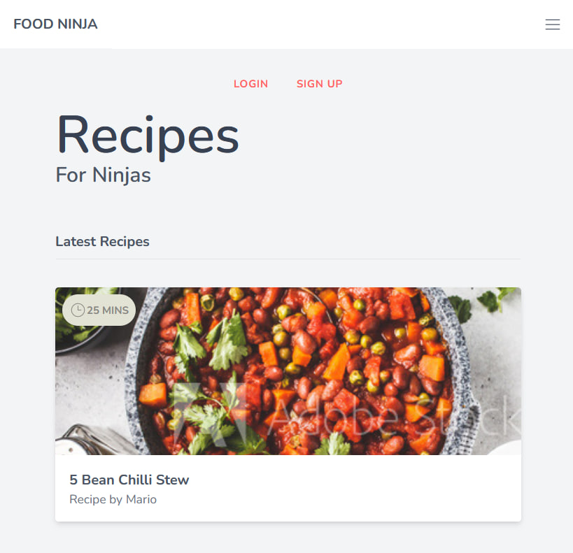

# Ninja Food
## Description

A web menu for a restaurant or cafe, with a responsive design for all kind of devices. It is made with Vue 3 and Tailwind CSS. **I you enjoy it!**

## Design




## Build Setup

```bash
# install dependencies
$ npm install

# compile tailwind changes
$ npm run build

# serve with hot reload at localhost:5173
$ npm run dev
```

## Contribution

To contribute to this project please check out the [contribution guidelines](https://github.com/YurisCodingClub/accessibility-mentor/blob/main/CONTRIBUTING.md).